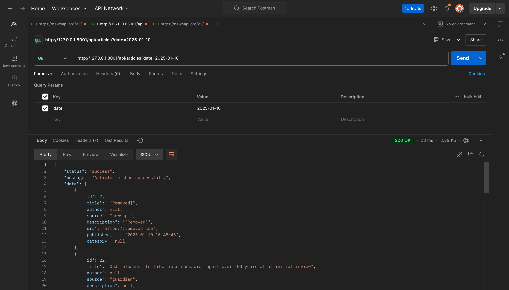

# News Aggregator

Welcome to the **News Aggregator**! This is a platform designed to fetch, process, and display news articles from multiple sources. It supports fetching articles from various news APIs and stores them in a database for later use. It can be extended to provide a customizable interface for displaying the news.

## Features

- **API Integration**: Fetches the latest news articles from various news APIs.
- **Automatic Updates**: News articles are fetched and stored regularly (every minute).
- **Article Storage**: Articles are stored in a database with relevant metadata.
- **Search & Filter**: Search for articles based on keywords and filter by source, date or category.

## Installation

### Prerequisites

Ensure you have the following installed:

- **PHP** >= 8.x
- **Composer** (for PHP package management)
- **MySQL**
- **Laravel 11** (This project is built using Laravel 11)
- **News API keys** (depending on which news APIs you integrate with)


**Command**: Schedule and run the `php artisan articles:fetch` command to store news to your database base on the news API you integrated




Clone the repository to your local machine:

```bash
git clone https://github.com/yourusername/news-aggregator.git
cd news-aggregator
composer install
php artisan migrate
